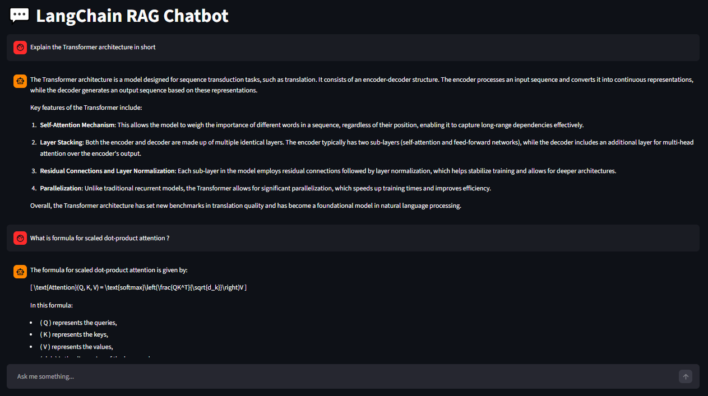

🤖 Chatbot with RAG and LangChain

A Retrieval-Augmented Generation (RAG) chatbot built with **LangChain**, **FAISS**, and **Streamlit** This project allows you read and load the pdfs with PyPDFLoader, index them into a FAISS vector store, and chat with the content using OpenAI’s GPT models.

📚 Prerequisites
•	Python 3.11+

🚀 Features
- **PDF ingestion**: Load and process PDF documents from disk using `PyPDFLoader`.
- **Text splitting**: Chunk documents using `RecursiveCharacterTextSplitter`.
- **Vector store**: Store embeddings in FAISS for fast similarity search.
- **OpenAI integration**: Use `ChatOpenAI` and `OpenAIEmbeddings` for responses.
- **Streamlit UI**: Simple, interactive web interface.
- **Persistent storage**: Save and reload FAISS indexes locally.

🛠️ Tech Stack
- [LangChain](https://www.langchain.com/)  
- [FAISS](https://github.com/facebookresearch/faiss)  
- [Streamlit](https://streamlit.io/)  
- [OpenAI](https://platform.openai.com/)  
- [Python Dotenv](https://pypi.org/project/python-dotenv/) 

⚙️ Installation & Setup

1. Clone the repository:
git clone https://github.com/MohitKB23/
cd Chatbot-with-RAG-and-LangChain

2. Create a virtual environment
python -m venv venv
3. Activate the virtual environment
venv\Scripts\Activate
(or on Mac): source venv/bin/activate
4. Install libraries
pip install -r requirements.txt
5. Add OpenAI API Key
Create the .env file in the directory folder. Add your OpenAI API Key into it.
OPENAI_API_KEY="your_openai_api_key_here"

▶️ How to Run ?

•	Open a terminal in VS Code
•	Execute the following command:
streamlit run chatbot.py

📂 Project Structure
chatbot-project/
│── chatbot.py                # Main chatbot implementation
|── data/                     # Folder for PDFs
  └── transformer_paper.pdf   # Example PDF
│── .env                      # Environment variables
│── requirements.txt          # Python dependencies
│── README.md                 # Project documentation 

🌟 App Screenshot
